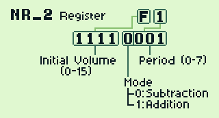

# Channel Envelope

Channels 1, 2 and 4 have a volume envelope. The volume envelope allows for
hardware volume control. The envelope is controlled by the NRx2 registers,
or NR12, NR22 and NR42 for channels 1, 2, and 4, respectively.
These registers have read and write access.

See the following diagrams for the format of these registers:




```
Bits 7-4: Initial volume (0-15)
Bit    3: Mode (0: attenuate, 1: amplify)
Bits 2-0: Period (0-7)
```

The upper nibble (bits 7-4) is the initial volume. The lower nibble (bits 3-0)
determine the mode of operation for the envelope. There are three modes:
constant, attenuate and amplify.

## Modes

### Constant

When the envelope register is `$x0` or `$x8`, the volume for the channel is
constant. The channel's volume will be `x`, indefinitely.

### Attenuate

When the lower nibble of the register is `1-7`, the volume will attenuate or
decrease from the initial until it reaches 0. This mode allows for smooth
fade outs. The volume decreases by 1 every `x/64` seconds, where `x` is the
period.

### Amplify

When the lower nibble of the register is `9-F`, the volume will amplify or
increase from the initial until it reaches the maximum, 15. This mode allows for
smooth fade ins. Similar to [Attenuate](#attenuate), the volume will increase
by 1 every `x/64` seconds, where `x` is the period.

## Registers

| Name | Memory address | Description                     |
|:----:|:--------------:|:-------------------------------:|
| NR12 | $FF12          | Channel 1 Volume Envelope (R/W) |
| NR22 | $FF17          | Channel 2 Volume Envelope (R/W) |
| NR42 | $FF21          | Channel 4 Volume Envelope (R/W) |

### Writing

After writing to any of these registers, the envelope will be unstable. It is
recommended that you immediately restart the channel after doing so (write `$80`
to `NRx4`). Restarting the channel restarts the envelope. The volume will be
set to its initial and will automatically increase or decrease, depending
on the mode that was set.

The exact behavior that occurs after writing depends on the model, and in some
cases, zombie mode takes effect. Zombie mode is a hardware bug that allows you
to change the volume level of the envelope without a channel restart. Since
Trackerboy does not utilize zombie mode, it will not be discussed here.

### Channel DAC

The envelope register also controls the channel's DAC (digital to analog converter).
When the upper 5 bits of the register are cleared, the DAC is off. A channel
restart is not necessary to turn the DAC off, as its status is updated
immediately after writing to the register.

Since the DAC has a DC offset, turning the DAC on or off will result in a change
in the DC offset.

## Pandocs

[FF12](https://gbdev.io/pandocs/Sound_Controller.html#ff12---nr12---channel-1-volume-envelope-rw)
[FF17](https://gbdev.io/pandocs/Sound_Controller.html#ff17---nr22---channel-2-volume-envelope-rw)
[FF21](https://gbdev.io/pandocs/Sound_Controller.html#ff21---nr42---channel-4-volume-envelope-rw)
