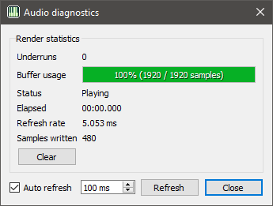
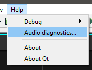

# Audio diagnostics

<!--  -->

The audio diagnostics dialog is a utility for displaying statistics about the
audio from the current render being played out. It can be opened from the
*Audio diagnostics...* action in the [Help](menus/help.md) menu.

## Statistics

 * *Underruns* - This is the total count of underruns[1](#footnote-underrun)
   that have occurred. Ideally this statistic should be zero. If you get
   underruns try increasing the [buffer size](configuration/sound.md#buffer-size) in the
   [Sound / Midi](configuration/sound.md) config.
 * *Buffer Usage* - This is the current utilization of the buffer, in samples.
 * *Status* - "Playing" if sound is being played, "Stopped" otherwise
 * *Elapsed* - Total time elapsed of the current render
 * *Refresh rate* - Time since the last [period][period-link], should be ±1ms of your period
   setting in the [Sound / Midi](configuration/sound.md) config.
 * *Samples written* - Number of samples written to the buffer during the last
   [period][period-link].

### Clear

You can clear the *Underruns* counter by clicking on the *Clear* button. Useful
for testing if a new sound configuration has any underruns.

## Refresh

By default, the dialog is automatically refreshed every 100 ms. You can change
the refresh rate by editing the spinbox or you can disable the auto-refresh by
checking off the *Auto-refresh* checkbox.

If auto-refresh is disabled the statistics will only be updated when you click
the *Refresh* button.

The *Refresh* button can be clicked at any time to force update the statistics.

<a name="footnote-underrun">1</a>: An underrun occurs when the buffer does not
contain enough samples that the audio device requests. Silence is filled in for
these missing samples and what you hear is a gap in playback.

[period-link]: configuration/sound.md#period