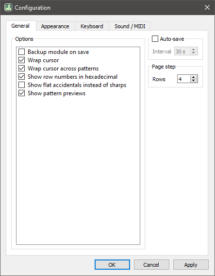

# Configuration

Application settings can be changed using the configuration dialog, which
can be opened from the [File](../menus/file.md) menu.

## Categories

The configuration is organized into the following categories:

 * [General](general.md)
 * [Appearance](appearance.md)
 * [Keyboard](keyboard.md)
 * [Sound / Midi](sound.md)

## File location

The configuration is stored in an [INI](https://en.wikipedia.org/wiki/INI_file)
file, and its location depends on your operating system.

| Operating system | Path                                      |
|:----------------:|:-----------------------------------------:|
| Windows          | `%APPDATA%\Trackerboy\Trackerboy.ini`     |
| Linux            | `$HOME/.config/Trackerboy/Trackerboy.ini` |
| MacOS            | `$HOME/.config/Trackerboy/Trackerboy.ini` |

You should not need to edit this file manually, and are discouraged from doing
so as the format may change in later versions. You can delete this file if you
would like to reset the configuration, or save a copy for backup purposes.