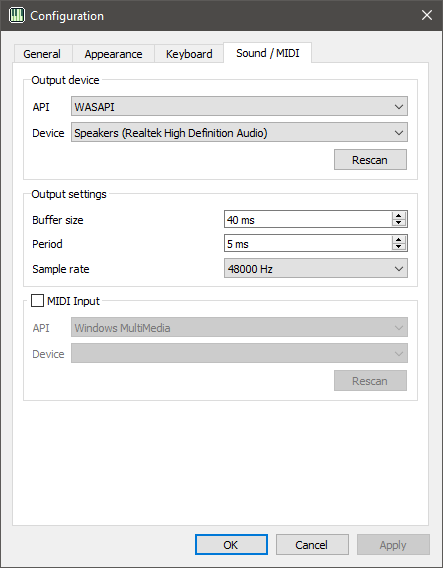

# Sound and MIDI configuration

Here you can configure your output device and (optionally) MIDI input device.

## Output device

Select the output device and API for sound output. The available APIs to
choose from depends on your operating system.

When changing the API the device combo will be repopulated with all available
devices in that API. You can also refresh the device combo by clicking the
*Rescan* button.

If the API cannot be used, the message "API Unavailable" will be shown under
the device combo box.

### Default device

Every API has a "Default device" option in the device list. This option will
use the API's definition of a default device. For some APIs, this allows for
automatic stream routing (ie switching the default device during playback).

### Null API

The Null API is available for every platform. This API contains one device, the
null device, which outputs sound nowhere. You can use this device if you don't
want sound to play out.

## Output settings

 - <a name="buffer-size">*Buffer size*</a> - sets the size, in milliseconds,
   of the playback buffer. This setting determines the overall latency of the
   output. 40 ms is the default setting. It is recommended that you increase
   this setting if you get any underruns.
 - <a name="period">*Period*</a> - this is the rate audio is generated and
   queued in the buffer. It also determines how often the UI is updated. It is
   recommended that the period is less than or equal to half the buffer size.
   Lower values requires more CPU use, so increase this if lower utilization is
   perferred. The default period is 5 ms.
 - *Samplerate* - the sample rate, in Hz, of the generated output. Output will
   be resampled using a linear resampler if the configured device does not
   support the sample rate. See [here](https://miniaud.io/docs/manual/index.html#LinearResampling)
   for more details on the resampler.

### Notes on latency

Latency depends mainly on two things: the buffer size and the latency provided
by the backend. Trackerboy will try to use the lowest latency possible for the
configured device, which on WASAPI is usually 10 ms. You may need to configure
your audio provider if a lower latency is desired, but for most cases the
default is acceptable.

## MIDI input

Click the checkbox if you would like to enable MIDI input handling for note
input. Similarly to the [output device](#output-device), select a backend and
device to use. If you need to update the device combo click the *Rescan* button.