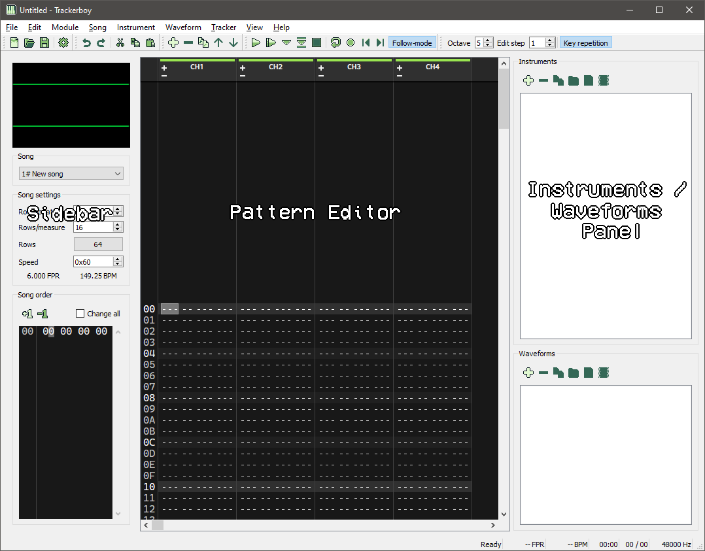

# Interface

The section describes every part of the Trackerboy interface.

Main window

 - Menus - [File](menus/file.md)
           [Edit](menus/edit.md)
           [Module](menus/module.md)
           [Song](menus/song.md)
           [Instrument](menus/instruments.md)
           [Waveform](menus/waveforms.md)
           [Tracker](menus/tracker.md)
           [View](menus/view.md)
           [Help](menus/help.md)
 - [Toolbars](toolbars.md)
 - [Sidebar](sidebar.md)
 - [Pattern editor](pattern-editor.md)
 - [Instruments / Waveforms panel](instruments-waveforms.md)
 - [Status bar](statusbar.md)
 
Editors

 - [Instrument editor](instrument-editor.md)
 - [Waveform editor](waveform-editor.md)

Misc

 - [Comments](comments.md)
 - [Module properties](module-properties.md)
 - [Tempo calculator](tempo-calculator.md)
 - [Shortcuts](shortcuts.md)
 - [Configuration](configuration/index.md)
