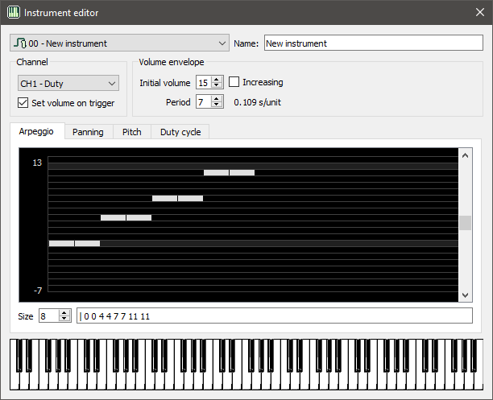

# The Instrument Editor

The Instrument Editor is a dialog for editing an instrument. You can open the
dialog by double-clicking an instrument in the Instruments list. You can also
open the dialog by using the `Ctrl+I` shortcut or via the [Instruments](menus/instruments.md)
menu.

For more details on how instruments work in Trackerboy, see [this page](../tracker/instruments.md)

## Instrument combo

The combo box at the top shows the current instrument being edited. To switch
to a different one, select the one you want to edit in the list.

## Name

Edit the input box to change the instrument's name. All new instruments will
have a placeholder name of "New Instrument".

## Channel

You can set the target channel here. The channel you set is only used when
previewing the instrument. Instruments can be used on any channel.

### Set volume/waveform on trigger

If this option is checked, then the channel envelope or waveform is set on each
note trigger. The adjacent group box allows you to edit the envelope/waveform
to set.

## Volume envelope / Waveform

Here you can change the initial envelope / waveform setting. For channels 1, 2
and 4, this group is for editing the envelope. For channel 3, it is a waveform
selector.

### Volume envelope

 - Initial volume: 0-15, the initial volume of the envelope.
 - Period: 0-7, the speed of the envelope (0 is constant, 1 is the fastest).
 - Increasing: If checked the volume will increase instead of decreasing.

### Waveform

 - Waveform combo: select the waveform here to set on note trigger.
 - Edit: Click this button to open the [Wave Editor](waveform-editor.md), to
         edit the selected waveform.

## Sequence editor

The sequence editor shows the sequence graphically and textually. You can edit
sequences by first selecting the tab of the sequence you want to edit, and then
by editing the sequence via the graph or text edit.

### Graph edit

The graph shows the sequence with the frame index on the x axis and the value
on the y axis. The size of the sequence (in frames) can be changed by using the
"Size" spin box. To change a value in the sequence click on the desired position
in the graph with the mouse.

### Text edit

The sequence data is also shown textually in the text edit on the bottom. The
format of this text is each value in the sequence separated by spaces. The
loop index is specified with the pipe character, `|`, and must precede a value
in order to take effect.

**NOTE**: Currently the only way to set a loop index is via the text edit.
Setting it graphically is not yet implemented but will be in the future.

## Piano

The piano input on the bottom can be used for previewing the instrument. Click
and hold a key to preview the instrument. The instrument is previewed on the
target channel. You can also use your keyboard or MIDI input device to input
keys. Try it out!
