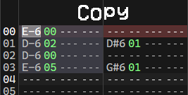
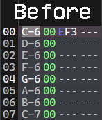
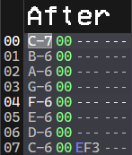

# Edit

## Undo

Undos the last change to the current song.

## Redo

Redos the last undone change.

---

## Cut

Copies the current selection to the clipboard and then erases it. If there is
no selection, the cursor contents are used instead.

## Copy

Copies the current selection or cursor to the clipboard.

## Paste

Pastes the clipboard contents to the pattern at the cursor. This type of paste
overwrites the contents at the cursor with clipboard data.

## Paste Mix

Same as [Paste](#Paste), but mixes the clipboard data with the contents at the
cursor. When mixing data, only empty columns get overwritten.

### Example

Only rows 00 and 02 were copied since they were empty in the destination region.

## Erase

Erases selection contents. If there is no selection, the cursor contents are
erased.

---

## Select All

Alternates between selecting the current track and the whole pattern.

---

## Transpose

Transposes the selected notes or cursor by a certain amount.

### Decrease note

Transposes the note down by 1 semitone.

### Increase note

Transposes the note up by 1 semitone.

### Decrease octave

Transposes the note down by 1 octave.

### Increase octave

Transposes the note up by 1 octave.

### Custom

Transposes the note by a specified number of semitones.

## Reverse

Reverses by row the selected region. Does nothing if there is no selection.

## Replace instrument

Replaces all selected instrument columns with the selected instrument. If no
instrument is selected this action does nothing.

---

## Key repetition

Toggles key repeat. When checked, holding down a key repeats it.
