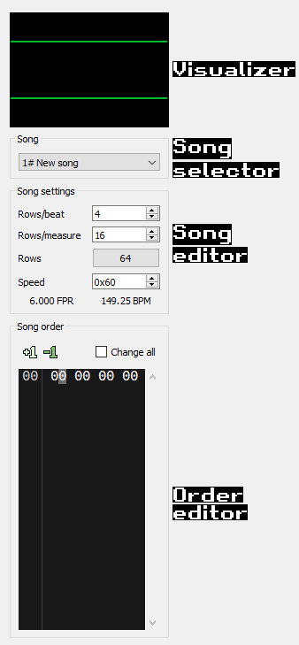

# The Sidebar

The sidebar is located to the left of the [Pattern editor](pattern-editor.md)
and contains controls for the current song.

## Visualizer

The visualizer is an oscilloscope for the left and right channels. The top
scope is the left channel and the bottom is the right. You can change the colors
in the [Appearance](configuration/appearance.md) config.

## Song selector

Use this combo box to change the current song to edit/play. New songs can be
added from the [Module properties](module-properties.md) dialog.

## Song editor

This section has controls for changing the song's settings.

 - *Rows/beat* - This setting determines the number of rows that make up a beat.
   It used for tempo calculation and for highlighting rows in the pattern editor.
   The default value for new songs is **4**.
 - *Rows/measure* - This setting determines how many rows make up a measure.
   This setting should be a multiple of the *Rows/beat* setting but this is not
   required. This setting is only used for highlighting rows in the pattern
   editor. The default value is **16**.
 - *Rows* - This is the number of rows each track contains. Click the button to
   change the setting. Note that setting a smaller size will truncate all
   tracks in the song and cannot be undone. The default setting is **64** rows.
 - *Speed* - Initial speed setting when playing the song. Note that the value
   is in hexadecimal. See [Speed](../tracker/speed.md) for more details. The
   default speed setting is **0x60**.

## Order editor

The order editor is where you edit the song's order. The song order is a list
of orders, which is a set of track ids (one for each channel). You can reuse
existing tracks across orders. Each song can have a maximum of 256 orders, and
must have at least 1 order.

To edit the order, move the cursor via the mouse or keyboard and edit the track
id via the keyboard.

### Change all

If this is checked, all track ids in the order will be edited via the keyboard
or increment/decrement actions.
