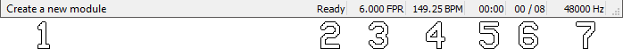

# Status bar

 1. Status message / tip.
 1. Output status.
    - *Playing* - device is playing sound.
    - *Ready* - device is ready to play.
    - *Device error* - An error has ocurred with the device and cannot be used.
      Reconfigure the device in the [Sound / Midi](configuration/sound.md) config.
 1. Current speed, in frames per row (FPR).
 1. Current tempo, in beats per minute (BPM).
 1. Elapsed time of music playback, in minutes:seconds.
 1. Position in song, first number is the order and the second is the row.
 1. Output sample rate, in Hertz (Hz).
