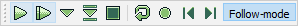

# Toolbars

This page explains all toolbars used in the application.

Each toolbar can be docked on either side of the main window, or can be left
floating anywhere on screen. By default all toolbars are position at the top
of the window.

Visibility of each toolbar can be toggled by clicking its corresponding menu
action in the [View > Toolbars](menus/view.md#toolbars) menu.

You can also reset the layout of all toolbars by clicking the
[View > Reset layout](menus/view.md#reset-layout) menu action.

## File toolbar

Contains actions from the [File](menus/file.md) menu.

[New](menus/file.md#new)
| [Open](menus/file.md#open)
| [Save](menus/file.md#save)
| [Configuration](menus/file.md#configuration)

## Edit toolbar

Contains actions from the [Edit](menus/edit.md) menu.

[Undo](menus/edit.md#undo)
| [Redo](menus/edit.md#redo)
| [Cut](menus/edit.md#cut)
| [Copy](menus/edit.md#copy)
| [Paste](menus/edit.md#paste)

## Song toolbar

Contains actions from the [Song](menus/song.md) menu.

[Insert order row](menus/song.md#insert-order-row)
| [Remove order row](menus/song.md#remove-order-row)
| [Duplicate order row](menus/song.md#duplicate-order-row)
| [Move order up](menus/song.md#move-order-up)
| [Move order down](menus/song.md#move-order-down)

## Tracker toolbar

Contains actions from the [Tracker](menus/tracker.md) and
[Module](menus/module.md) menus.

[Play](menus/tracker.md#play)
| [Play from start](menus/tracker.md#play-from-start)
| [Play at cursor](menus/tracker.md#play-at-cursor)
| [Step row](menus/tracker.md#step-row)
| [Stop](menus/tracker.md#stop)
| [Pattern repeat](menus/tracker.md#pattern-repeat)
| [Record](menus/tracker.md#record)
| [Previous song](menus/module.md#previous-song)
| [Next song](menus/module.md#next-song)
| [Follow mode](menus/tracker.md#follow-mode)

## Input toolbar

 - *Octave* - Base octave used when entering notes. Default is **5**.
 - *Edit step* - Amount of rows the editor steps down to when entering data.
   Default is **1**.
 - *[Key repetition](menus/edit.md#key-repetition)* - If enabled keys will be
   repeated when held down. Key repetition is **enabled** by default.
